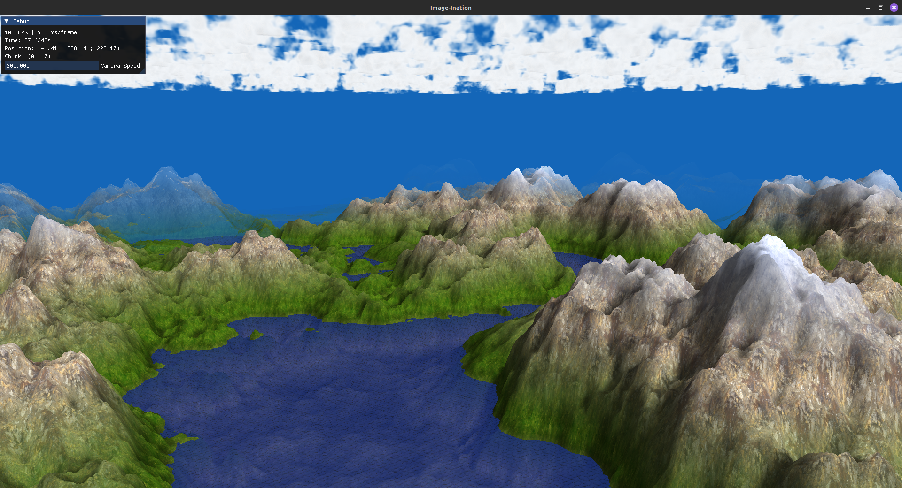
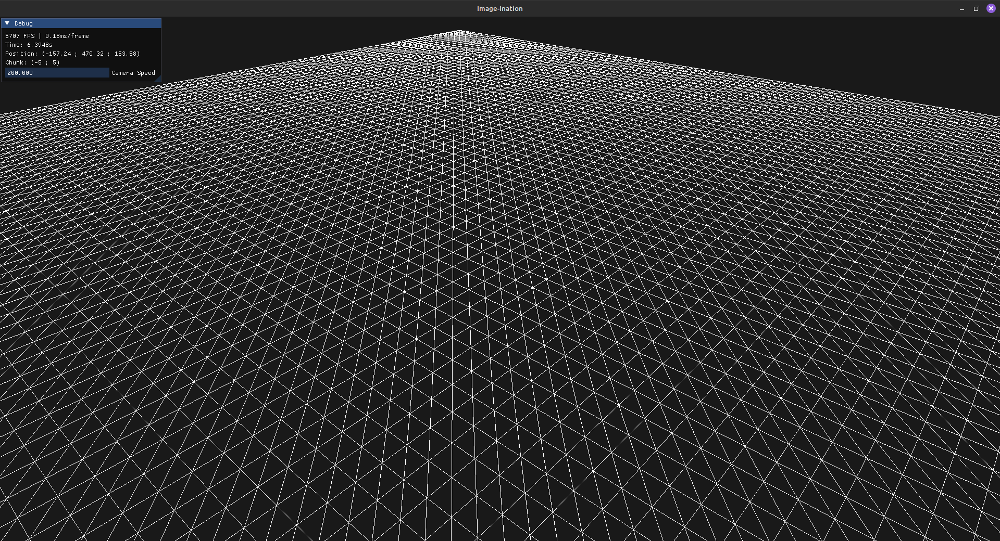
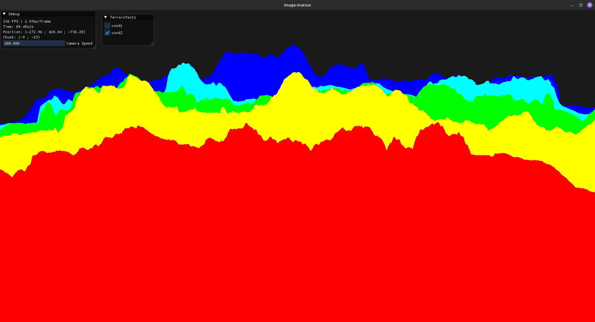
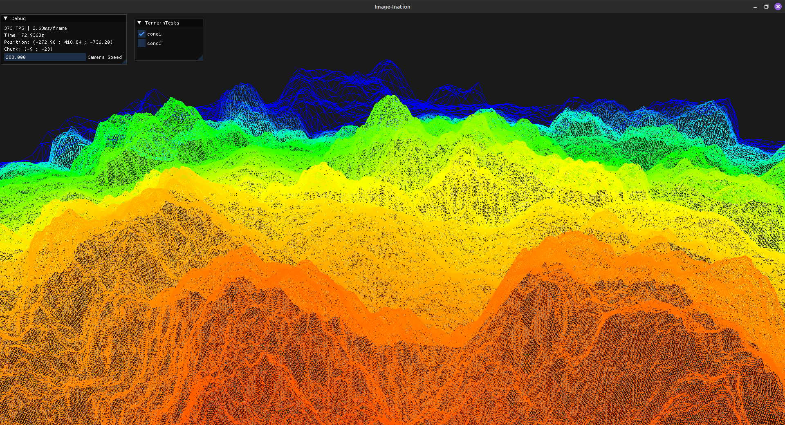
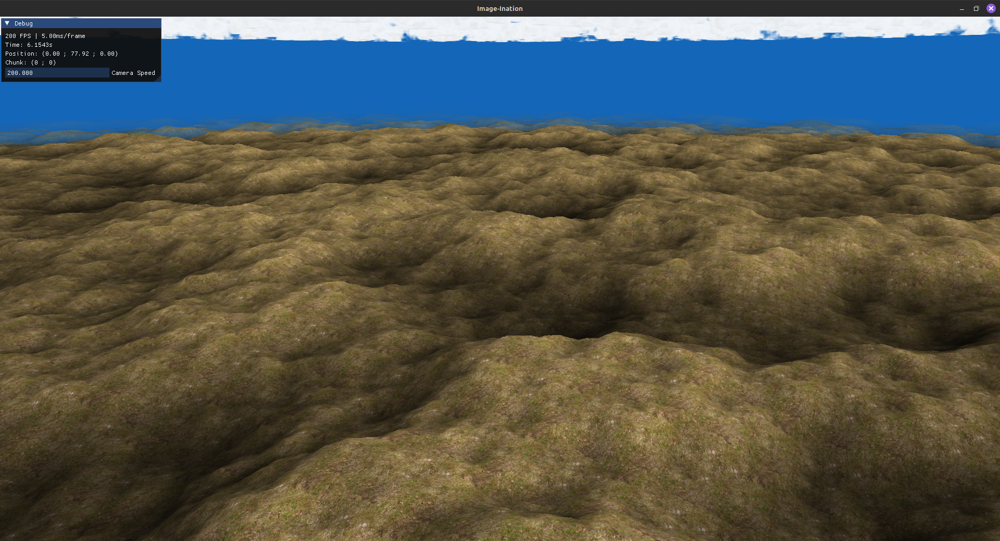
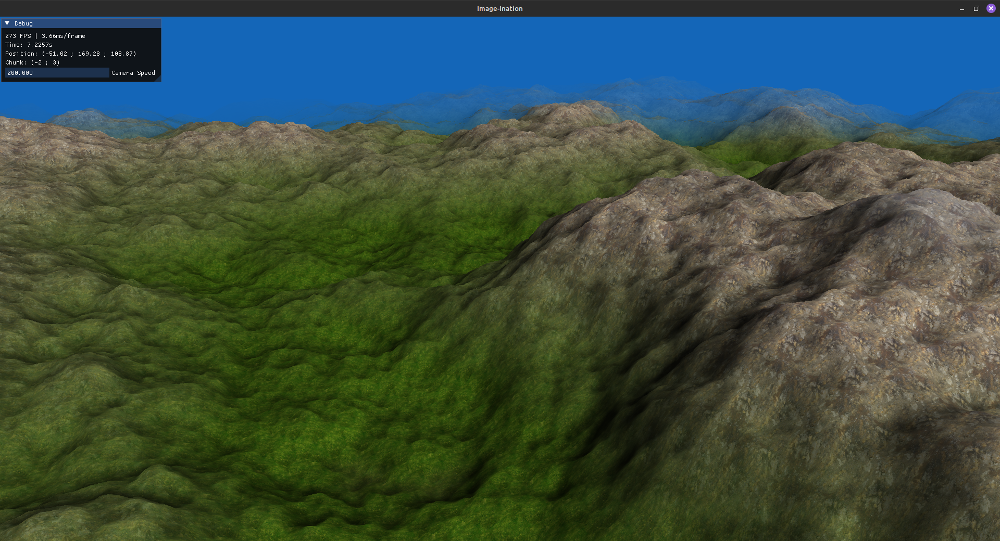
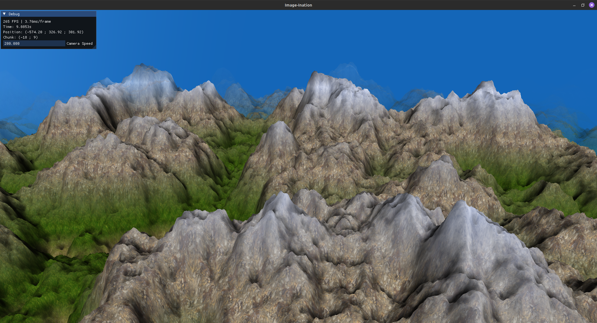

# Image-Ination


## Project Description
This project is a simulation of clouds, water and a terrain using OpenGL.
The terrain was done by [Killian](https://github.com/llikian).
The water was done  by [Minas](https://github.com/Minas02).
Thet clouds were done by [Raphaël](https://github.com/zbeubizbeub).

Since the engine part wasn't the focus of this project, we used [llikian's OpenGL engine](https://github.com/llikian/OpenGL-Engine)
for the rendering, and so we won't be talking about how it works here.

### Structure
```
./
├─ bin/         # Binary Files
├─ data/        # Assets (textures, etc...)
├─ include/     # Header files (.hpp files)
├─ lib/         # Source code of libraries
├─ screenshots/ # Screenshots of the application
├─ shaders/     # Shader code files (.vert, .frag, etc...)
└─ src/         # Source code files (.cpp files)
```

### How it works
#### Terrain
The terrain's initial mesh is a simple 128 by 128 grid on the XZ plane with each square the grid's
squares having a side length of 32 units. We will call each of these squares a chunk.


In its initial state this mesh would not make for a very detailed or interesting terrain, which is why
we will use one of OpenGL's optional pipeline stages: tesselation.

Tesselation is a method that allow to dynamically subdivide a mesh. We use this to create levels of
detail, so that the further a chunk is from the camera, the less detailed it is. So chunks that are
closest to the camera will be divided in a 32 by 32 grid and the further we get from the camera, the
less they will be divided.

Here is a visual way to see the mesh's dynamic subdivision, each of the color represents
areas with different division levels (red are subdivision levels between 16 and 32, yellow is for
levels between 8 and 16, etc...):


Here, the color is more smooth and the mesh is rendered in wireframe mode to more clearly see the differences:


Once the mesh is properly subdivided, we need to assign a height to each of the vertices. This is done
by combining the results of 3 different Perlin noises. For each vertex, we calculate 3 different
heights, by using Perlin noise with different frequency and amplitude values in order to create more
diversity in the terrain. The first noise aims to create plains, so it has low amplitude and average
frequency, the second has a higher amplitude and aims to create hills and higher plains and the
third and last noise has a low frequency and high amplitude to create mountains.

Plains:


Hills:


Mountains


Finally, the last step is to color the terrain. To do this, we first calculate illumination, for this
we used a simplified Phong model where we ignored specular reflections because except for the areas
that were supposed to be snowy, it wouldn't make sense to have a "shiny" terrain since it's mostly
supposed to be dirt, grass and rock. The light is calculated using the normals that we previously
calculated and produces a global illumination.

Next, we need to apply textures to the terrain, otherwise it would look quite boring. Each point on
the terrain will have its color determined by the height. For each of the four textures that we use
we define a "low" height, a "perfect" height and a "high", at the perfect height the color will only
be defined by that texture, for any value in between we interpolate. So if the point is bellow
a texture's perfect height, we interpolate the color according to the lower texture's high height and
the current one's low height, same principle if the point is higher but in the opposite direction.

After all of this we apply a simple fog effect by calculating a fog factor according to the point's
distance to the camera so that we don't see where the terrain ends.

Here is a diagram of how the pipeline looks and what each stage does:


## Setup
### Dependencies
You can install the dependencies with the following instructions:

#### Linux
##### Debian Based Distributions
```shell
sudo apt install -y git g++ cmake make libglfw3-dev libxxf86vm-dev libxi-dev libglm-dev
```

##### Arch Based Distributions
```shell
sudo pacman -Sy git gcc cmake make glfw-x11 libxxf86vm libxi glm
```

##### Fedora Based Distributions
```shell
sudo dnf install -y git gcc-c++ cmake make glfw-devel libXxf86vm-devel libXi-devel glm-devel
```

#### Mac OS
You can install all dependencies using [Homebrew](https://brew.sh/).

```shell
brew install git cmake make glfw glm
```

### Clone Repository
```shell
git clone https://github.com/llikian/Image-Ination.git
cd Image-Ination
```

### Build
To build you can simply run the `release.sh` script at the root of the project using:
```shell
bash release.sh
```

You can also manually build it using:
```shell
cmake -B build && \
cmake --build build -j
```

Then you can run it using:
```shell
bin/Image-Ination
```

## Credits
This project was done in the context of the teaching unit of [LIFPROJET](http://cazabetremy.fr/wiki/doku.php?id=projet:presentation#enseignants)
at [University Claude Bernard Lyon 1](https://www.univ-lyon1.fr/).

Graphics are handled with [OpenGL](https://www.opengl.org/), using the [GLAD](https://github.com/Dav1dde/glad) implementation.

Window management and event handling are done with [GLFW](https://www.glfw.org/).

Image loading is done with [stb_image](https://github.com/nothings/stb).

Mathematics functionnality, such as vectors and matrices were handled by [GLM](https://github.com/g-truc/glm).